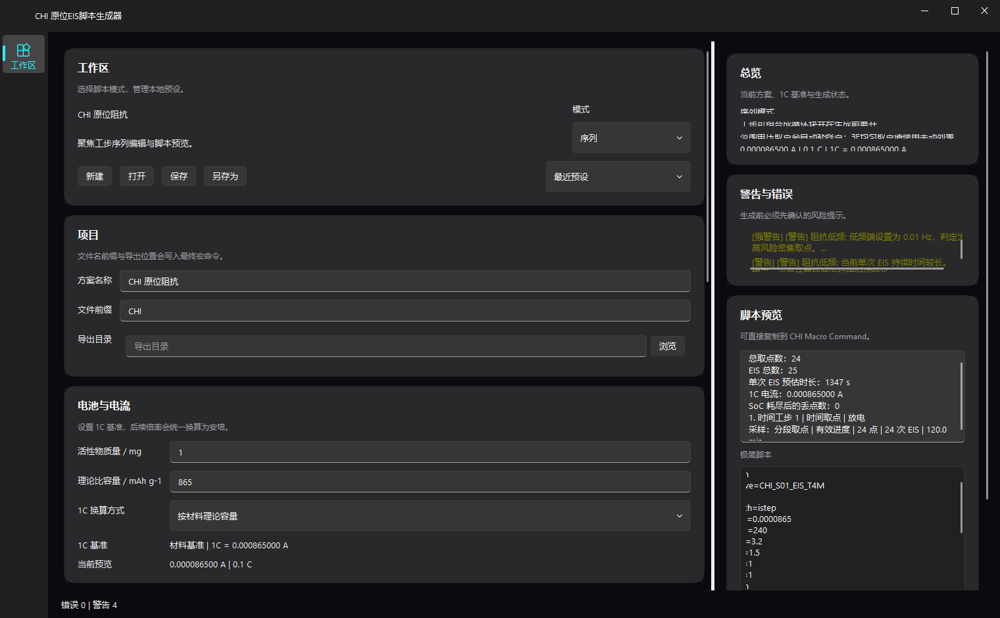
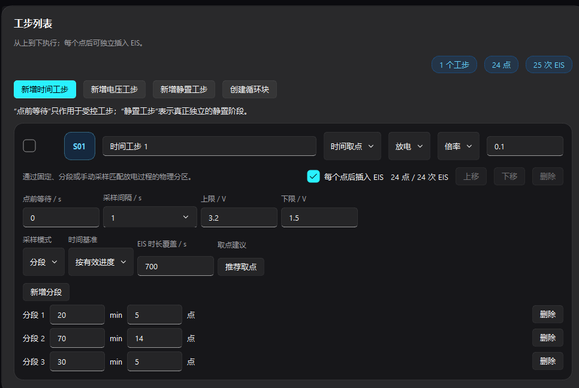
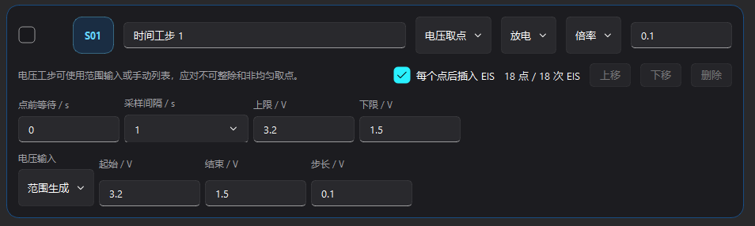
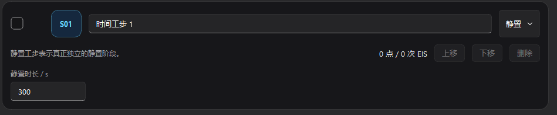
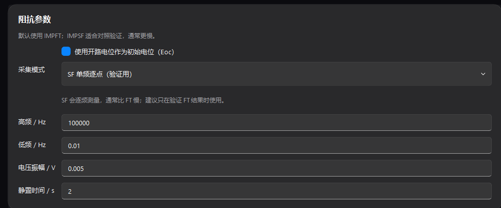

# OPEIS Master

**OPEIS Master** 是一个面向辰华 CHI 电化学工作站的本地桌面工具，用来生成原位阻抗（in-situ EIS）实验脚本。它把工步、充放电电流、时间/电压取点、阻抗参数和风险校验集中到一个 GUI 中，最终输出可直接粘贴到 **CHI Macro Command** 的纯命令脚本。

软件的核心目标是减少手写 CHI 宏命令时的错误：所有倍率换算、取点展开、EIS 插入、文件命名和 Warning / Error 都在生成前完成检查。



## 适用场景

- 固定时间点原位 EIS：例如在放电 20、40、60 min 等进程点插入 EIS。
- 固定电压点原位 EIS：例如放电到 3.2、3.0、2.8、2.6 V 后分别测阻抗。
- 充电 / 放电交替流程：可以把多个充电、放电、静置工步从上到下组合。
- 循环块流程：把多个连续工步打包后重复执行。
- 脉冲前后 EIS：用于比较弛豫、脉冲和脉冲后状态。
- 风险预检查：低频 EIS 时间过长、EIS 插入过密、SoC 可能耗尽、静置过长等情况会在右侧提示。

## 下载安装

Windows 用户下载发布包后解压运行：

- 包名：`CHI-OPEIS-v0.2.0-windows-x64.zip`
- 主程序：`CHI-OPEIS.exe`
- 注意：不要只单独复制 exe，必须保留解压后的完整目录，尤其是同级 `_internal/` 目录。

当前本地构建包 SHA256：

```text
1ED44979CEDF6B4FF82237D1AD7F79C53637423FBA6369774F56E35AABA45D7B
```

## 总体使用流程

1. 在 **工作区** 选择脚本模式：`序列` 或 `脉冲`。
2. 在 **项目** 填写方案名称、文件前缀和导出目录。
3. 在 **电池与电流** 设置 1C 换算方式。
4. 在 **工步列表** 添加时间工步、电压工步、静置工步或循环块。
5. 在每个工步里设置方向：`充电` 或 `放电`，再设置电流、上下限电压、采样方式和是否插入 EIS。
6. 在 **阻抗参数** 设置 IMPFT / IMPSF、`fh`、`fl`、`amp`、`qt` 等参数。
7. 查看右侧 **总览**、**警告与错误** 和 **脚本预览**。
8. 没有阻断错误后，复制 **极简脚本** 到 CHI Macro Command。

## 1. 工作区、项目与电池电流


### 工作区

工作区决定当前生成哪类脚本：

| 模式 | 适合用途 |
| --- | --- |
| `序列` | 多个充电、放电、静置、EIS 工步按顺序执行，是最常用的原位 EIS 流程 |
| `脉冲` | 弛豫 - 脉冲 - EIS - 可选尾段电压放电，适合瞬态扰动前后对比 |

工作区支持本地预设：

- `新建`：恢复默认参数。
- `打开`：载入 `.chi-preset`。
- `保存` / `另存为`：保存当前全部界面设置。
- `最近预设`：快速回到最近使用的方案。

### 项目

项目区控制输出文件命名和保存位置：

- `方案名称`：只用于界面总览和摘要，帮助辨认实验方案。
- `文件前缀`：会进入每个保存文件名，例如 `CHI_S01_EIS_20M`。
- `导出目录`：会写入 CHI 脚本的 `folder=` 命令。默认留空时使用 `.`，避免暴露本机用户路径。

命名原则：

- 建议每个实验用不同 `文件前缀`，例如 `CFX01`、`CELL_A_25C`。
- 如果重复运行同名脚本，当前脚本使用 `fileoverride`，CHI 会覆盖同名文件。
- 正式测试前建议先用短流程确认导出目录和命名是否正确。

### 电池与电流

电池区用于统一换算倍率电流。软件支持两种 1C 基准：

| 方式 | 需要填写 | 适合情况 |
| --- | --- | --- |
| 按材料理论容量 | 活性物质量 / mg，理论比容量 / mAh g-1 | 半电池或按活性物质质量估算倍率 |
| 按已知倍率电流 | 已知倍率 / C，对应电流 / A | 已经从设备、历史实验或其他计算得到了某倍率电流 |

设置原则：

- 如果后续工步用 `倍率` 输入，必须先确认 1C 基准正确。
- 如果样品质量或理论容量不确定，更建议使用 `绝对电流` 输入，避免倍率误差被放大。
- 右侧总览会显示当前电流预览，方便确认 `0.1 C`、`1 C` 等倍率是否对应预期电流。

## 2. 时间取点工步



时间取点工步适合“按实验进程”测 EIS。它输出的是一段段恒流 `ISTEP`，到达指定累计时间后插入 EIS。

### 基本字段

| 字段 | 说明 |
| --- | --- |
| 工步名称 | 仅用于界面和摘要，建议写清楚用途，例如 `放电时间取点` |
| 工步类型 | 选择 `时间取点` |
| 方向 | `放电` 或 `充电` |
| 电流输入 | `倍率` 或 `绝对电流` |
| 点前等待 / s | 每个取点前额外静置的时间；不需要等待时填 `0` |
| 采样间隔 / s | 恒流段 CHI 采样间隔，常用 `1`、`0.1`、`0.01` |
| 上限 / V、下限 / V | 恒流段安全电压边界 |
| 每个点后插入 EIS | 勾选后每个时间点后都会插入一次 EIS |

### 放电与充电的区别

| 项目 | 放电 | 充电 |
| --- | --- | --- |
| 电流符号 | 软件渲染为正电流 | 软件渲染为负电流 |
| 电压边界理解 | 上限是安全上边界，下限是放电截止保护 | 上限是充电截止保护，下限是安全下边界 |
| 常见取点 | 按放电累计时间，例如 20、40、60 min | 按充电累计时间，例如充电恢复过程中的关键时刻 |
| EIS 解释 | 代表放电进程中的界面状态 | 代表充电进程中的界面状态 |

原则上，同一个工步只做一个方向。需要“放电 - 静置 - 充电 - 静置”时，建议拆成多个工步，这样每段的文件名、取点和风险提示更清楚。

### 采样模式

时间取点支持三种采样方式：

| 模式 | 设置方式 | 适合场景 |
| --- | --- | --- |
| 固定 | 设置总时长，再按固定间隔或固定点数生成 | 已知总实验时间，希望均匀取点 |
| 分段 | 给每一段设置时长和点数 | 前期变化快、平台期变化慢、末期变化快的放电曲线 |
| 手动 | 手动输入累计时间点 | 已经有文献或前期实验确定的关键时间 |

截图中的示例是分段取点：

| 分段 | 时长 | 点数 | 目的 |
| --- | --- | --- | --- |
| 分段 1 | 20 min | 5 点 | 前期变化较快，取点稍密 |
| 分段 2 | 70 min | 14 点 | 平台期，需要连续追踪 |
| 分段 3 | 30 min | 5 点 | 末期变化加快，再加密 |

### 时间基准

`时间基准` 决定 EIS 插入时间如何影响后续恒流时间：

| 时间基准 | 含义 | 适合情况 |
| --- | --- | --- |
| 按有效进度 | 时间点只按恒流有效运行时间展开；EIS 中断不补偿 | 想明确看到“恒流 - EIS - 恒流”的间歇过程 |
| 中断补偿 | 后续点位会考虑 EIS 占用时间，尽量维持目标进程 | EIS 很长，但希望后续取点更接近原始时间计划 |
| 等效容量补偿 | 按容量消耗思路调整恒流时长 | 需要控制等效充放电量时使用 |

设置原则：

- 初次使用建议选 `按有效进度`，逻辑最直观。
- 如果 `fl=0.01 Hz` 且每个点都插入 EIS，单次 EIS 会很长，补偿模式可能让后续时间明显变化，必须查看 Warning。
- `EIS 时长覆盖 / s` 用于手动指定单次 EIS 估算时长；不确定时可用默认估算。

### 时间工步示例

**示例 A：常规放电原位 EIS**

- 方向：`放电`
- 电流输入：`倍率`
- 倍率：`0.1 C`
- 上限 / 下限：`3.2 V / 1.5 V`
- 采样模式：`分段`
- 分段：`20 min 5 点`、`70 min 14 点`、`30 min 5 点`
- 每个点后插入 EIS：开启

适合：已经知道放电过程大约分为前期、平台期和末期，希望沿时间轴追踪阻抗变化。

**示例 B：充电恢复过程 EIS**

- 方向：`充电`
- 电流输入：`倍率`
- 倍率：`0.05 C`
- 上限 / 下限：按电池体系设置安全窗口
- 采样模式：`手动`
- 手动点：例如 `10, 30, 60, 120 min`

适合：关注充电恢复过程中界面阻抗变化。充电电流会自动使用负号，不需要手动输入负电流。

## 3. 电压取点工步



电压取点工步适合“到达指定电压后测 EIS”。它输出恒流 `CP` 段，到目标电压后保存恒流段，再按需要插入 EIS。

### 基本字段

| 字段 | 说明 |
| --- | --- |
| 工步类型 | 选择 `电压取点` |
| 方向 | `放电` 或 `充电` |
| 电流输入 | `倍率` 或 `绝对电流` |
| 上限 / 下限 | CP 运行的安全电压窗口 |
| 电压输入 | `范围生成` 或 `手动列表` |
| 起始 / 结束 / 步长 | 范围生成时使用 |
| 每个点后插入 EIS | 勾选后每个目标电压后测一次 EIS |

### 放电电压点

放电时，目标电压通常从高到低：

```text
3.2, 3.1, 3.0, 2.9, ..., 1.5
```

设置原则：

- `起始 / V` 应高于 `结束 / V`。
- `步长 / V` 填正数，例如 `0.1`。
- 下限电压应覆盖最低目标点，否则 CP 可能提前停止。
- 如果使用手动列表，建议按高到低输入；如果输入为单调升序，软件会按放电方向处理，但为了检查方便仍建议手动写成降序。

### 充电电压点

充电时，目标电压通常从低到高：

```text
1.5, 1.7, 1.9, 2.1, ..., 3.2
```

设置原则：

- `起始 / V` 应低于 `结束 / V`。
- 上限电压是充电安全截止，应高于或等于最高目标点。
- 下限电压更多是安全下边界，不是充电目标。
- 软件会提示充电电压点会从 CP 直接切入 PEIS，需要确认目标电压和安全边界是否符合方案。

### 电压取点 vs 时间取点

| 对比项 | 时间取点 | 电压取点 |
| --- | --- | --- |
| 取点依据 | 累计时间 / 进程 | 目标电压 |
| 常用 CHI 段 | `ISTEP` | `CP` |
| 优点 | 时间轴清楚，适合比较过程 | 状态点明确，适合比较不同电压下阻抗 |
| 风险 | EIS 中断会拉长总历时 | 接近 OCV 或平台区时，目标电压可能很快到达或停留很久 |
| 推荐场景 | 固定时间追踪、文献复现实验 | 指定电压态阻抗、充放电曲线关键电位 |

### 电压工步示例

**示例 A：放电到固定电压测 EIS**

- 方向：`放电`
- 倍率：`0.1 C`
- 上限 / 下限：`3.2 V / 1.5 V`
- 电压输入：`范围生成`
- 起始 / 结束 / 步长：`3.2 / 1.5 / 0.1`
- 每个点后插入 EIS：开启

**示例 B：只测关键平台电压**

- 方向：`放电`
- 电压输入：`手动列表`
- 电压点：`3.2, 3.05, 2.95, 2.8, 2.4, 2.0, 1.5`

适合平台较长或电压变化不均匀的材料。手动列表比固定步长更容易表达真正关心的物理状态。

## 4. 静置工步



静置工步表示真正独立的休息阶段，不是“点前等待”。它不会执行充电或放电，也不会生成 EIS 点。

| 字段 | 说明 |
| --- | --- |
| 工步类型 | `静置` |
| 静置时长 / s | 该阶段持续时间 |
| 点数 / EIS | 固定为 `0 点 / 0 次 EIS` |

静置工步适合这些情况：

- 放电后等待电压回稳，再进入 EIS 或下一段充电。
- 充放电切换方向前加入缓冲。
- 模拟实验方案中的开路休息阶段。
- 把“点前等待”和“独立静置阶段”分开记录。

设置原则：

- 如果每个取点前都需要等待，用工步里的 `点前等待 / s`。
- 如果是流程中的独立休息阶段，用 `静置工步`。
- 如果总静置时间超过电化学工作时间，软件会提示确认该方案是否有意设计。

## 5. 阻抗参数



阻抗参数会应用到序列模式和脉冲模式中的 EIS 段。

| 字段 | CHI 含义 | 建议 |
| --- | --- | --- |
| 使用开路电位作为初始电位（Eoc） | 使用当前开路电位作为 `ei` | 原位测试通常建议开启 |
| 采集模式 | `IMPFT` 或 `IMPSF` | 常规长流程推荐 FT；SF 主要用于对照验证 |
| 高频 / Hz | `fh` | 常见默认 `100000` |
| 低频 / Hz | `fl` | 越低单次 EIS 越慢；`0.01` 会触发高风险提示 |
| 电压振幅 / V | `amp` | 小扰动常用 `0.005` |
| 静置时间 / s | `qt` | EIS 前短暂等待，默认 `2` |

### FT 与 SF 的选择

| 模式 | 特点 | 推荐用途 |
| --- | --- | --- |
| FT 快速多频 | 更适合长时间、多点原位 EIS | 常规原位实验默认选择 |
| SF 单频逐点 | 通常更慢，但可作为验证方式 | 对 FT 结果有疑问时做对照 |

### 低频设置原则

- `fl=0.01 Hz` 可以覆盖低频信息，但单次 EIS 很长，点数多时总实验时间会快速增加。
- 如果只想快速检查趋势，可先用较高低频端做预实验。
- 如果必须使用 `0.01 Hz`，建议减少取点数量，或只在关键点插入 EIS。

## 6. 右侧预览与风险提示

右侧区域会随着设置实时刷新：

- **总览**：显示当前模式、1C 基准、当前电流、总取点数、EIS 次数和总历时。
- **警告与错误**：列出高风险或阻断问题。
- **采样看板**：当存在 SoC 丢点风险时显示预测。
- **脚本预览**：上方是摘要，下方是可复制的极简 CHI 脚本。

Warning 不一定阻止生成，但必须人工确认。Error 会阻止复制，必须修正后才能生成。

常见 Warning：

- `fl=0.01 Hz`：低频端很低，单次 EIS 预计较长。
- EIS 插入次数较多：会明显打断恒流曲线。
- 中断补偿时间累计较大：后续恒流时间会被明显拉长。
- 充放电方向频繁切换：需要确认是否符合实验设计。
- 静置总时长超过充放电工作时长：需要确认是否故意设置。
- SoC 预测归零：后续部分 EIS 点可能无法实际完成。

## 7. 脉冲模式

脉冲模式用于“弛豫 - 脉冲 - 阻抗”的扰动实验。虽然上面的截图主要展示序列模式，软件也支持单独的脉冲参数页。

主要设置：

| 设置 | 说明 |
| --- | --- |
| 弛豫模式 | `静置` 或 `恒流` |
| 弛豫时间 / s | 脉冲前等待或小电流恢复时间 |
| 弛豫电流输入 | 弛豫为恒流时，可选倍率或绝对电流 |
| 脉冲电流输入 | 倍率或绝对电流 |
| 脉冲时长 / s | 单次脉冲持续时间 |
| 脉冲次数 | 重复脉冲数量 |
| 采样间隔 / s | 脉冲段数据采样间隔 |
| 上限 / 下限 | 脉冲段安全电压边界 |
| 点前等待 / s | 脉冲前额外等待 |
| 追加电压放电段 | 所有脉冲结束后，按电压点继续放电并可插入 EIS |

使用原则：

- 高倍率脉冲建议先用短时间、少次数试运行。
- 脉冲前后阻抗不要直接等同于静态 OCV 阻抗，需要结合弛豫时间解释。
- 追加电压放电段适合在脉冲后继续追踪放电状态。
- 如果脉冲段采样间隔很小，数据量会明显增加。

## 8. 常用方案示例

### 示例 1：默认放电时间点原位 EIS

目标：在 0.1 C 放电过程中按前期、平台期、末期分段测 EIS。

建议设置：

- 模式：`序列`
- 电池：`1 mg`，`865 mAh g-1`
- 工步：`时间取点`
- 方向：`放电`
- 电流：`倍率 0.1`
- 上限 / 下限：`3.2 / 1.5 V`
- 采样模式：`分段`
- 分段：`20 min 5 点`、`70 min 14 点`、`30 min 5 点`
- EIS：每个点后插入
- 阻抗：`FT`，`fh=100000`，`fl=0.01`，`amp=0.005`，`qt=2`

注意：该方案点数多且低频端低，右侧会出现高风险 Warning。正式实验前应确认总时长和样品容量是否能支撑全部点位。

### 示例 2：放电电压点原位 EIS

目标：比较不同放电电压状态下的阻抗。

建议设置：

- 工步：`电压取点`
- 方向：`放电`
- 电流：`0.05 C` 或 `0.1 C`
- 电压输入：`范围生成`
- 起始 / 结束 / 步长：`3.2 / 1.5 / 0.1`
- EIS：每个点后插入

适合：关注电压状态而不是严格时间轴。若电压平台很长，可以改用手动列表，只保留真正关心的电压点。

### 示例 3：充电电压点原位 EIS

目标：在充电恢复过程中按目标电压测 EIS。

建议设置：

- 工步：`电压取点`
- 方向：`充电`
- 电流：`倍率 0.05`
- 电压输入：`范围生成` 或 `手动列表`
- 起始 / 结束 / 步长：例如 `1.5 / 3.2 / 0.1`
- 上限：应覆盖最高目标电压
- 下限：作为安全下边界

注意：充电方向会自动使用负电流。不要为了“充电”手动输入负数；只需要选择方向为 `充电`。

### 示例 4：放电 - 静置 - 充电循环

目标：模拟完整循环中的不同状态，并在关键阶段插入 EIS。

建议流程：

1. `时间取点`，方向 `放电`，关键时间点插入 EIS。
2. `静置工步`，例如 `300 s`。
3. `电压取点` 或 `时间取点`，方向 `充电`。
4. 必要时再加入 `静置工步`。
5. 如果要重复该流程，选中连续工步后创建循环块。

原则：充放电方向切换时建议加入静置阶段，便于解释后续阻抗变化。

### 示例 5：脉冲前后 EIS

目标：观察高倍率扰动前后界面阻抗变化。

建议设置：

- 模式：`脉冲`
- 弛豫模式：`静置`，例如 `60 s`
- 脉冲电流：`倍率 1 C` 或更高，按体系谨慎设置
- 脉冲时长：例如 `5 s`
- 脉冲次数：先从 `1` 或少次数开始
- 阻抗：先用较快低频端做预实验，再决定是否降到 `0.01 Hz`

## 9. 输出脚本约定

生成脚本遵循这些约定：

- 脚本头部包含 `fileoverride`、`folder=...`、`cellon`。
- 脚本结尾包含 `celloff`、`end`。
- 时间取点恒流段使用 `tech=istep`。
- 电压取点恒流段使用 `tech=cp`。
- 阻抗段使用 `tech=imp`，并根据采集模式输出 `impft` 或 `impsf`。
- 输出文件名会自动带上工步序号和类型，例如 `S01_CC`、`S01_EIS`、`PULSE`、`TAIL_EIS`。
- 最终脚本只包含 CHI 命令，不包含计算公式。

## 10. 开发运行

```powershell
py -3.11 -m venv .venv
.\.venv\Scripts\python -m pip install -e .[dev,build]
.\.venv\Scripts\python -m chi_generator.main
```

运行测试：

```powershell
$env:QT_QPA_PLATFORM="offscreen"
.\.venv\Scripts\python -m pytest -q
```

打包 Windows EXE：

```powershell
.\build.bat
```

## 项目结构

```text
src/chi_generator/
├── domain/          领域模型、计算、校验、脚本渲染
├── services/        脚本生成与预设服务
├── ui/              PySide6 / Fluent Widgets 界面层
├── app.py           应用装配入口
└── main.py          主入口
tests/               领域、渲染、GUI 合同测试
docs/                使用、架构、配置、测试和打包文档
image/               README 使用截图
```

## 许可证

本项目基于 MIT License 开源，详见 [LICENSE](LICENSE)。
