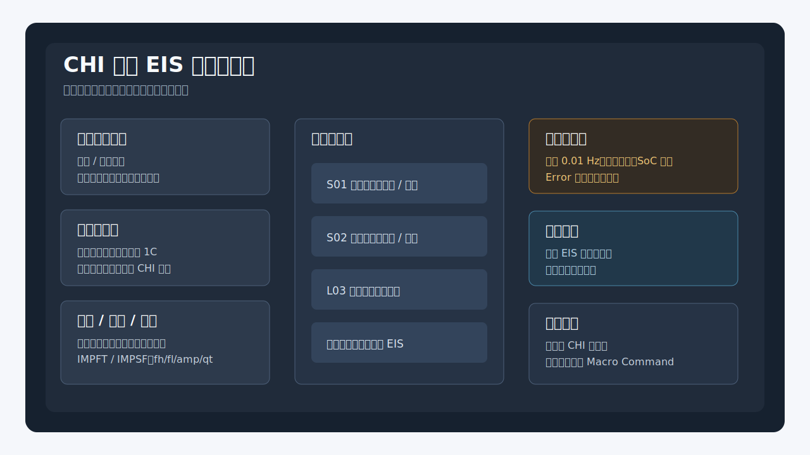
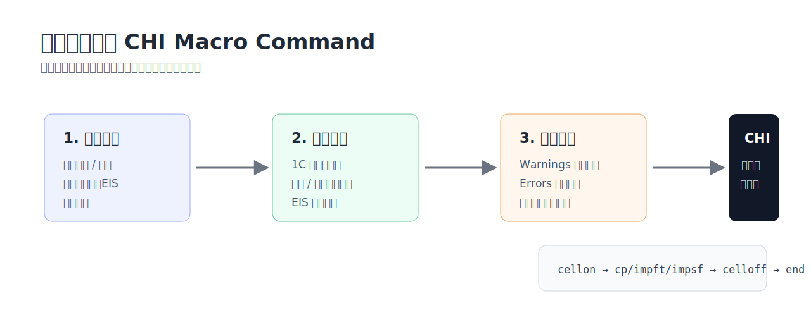
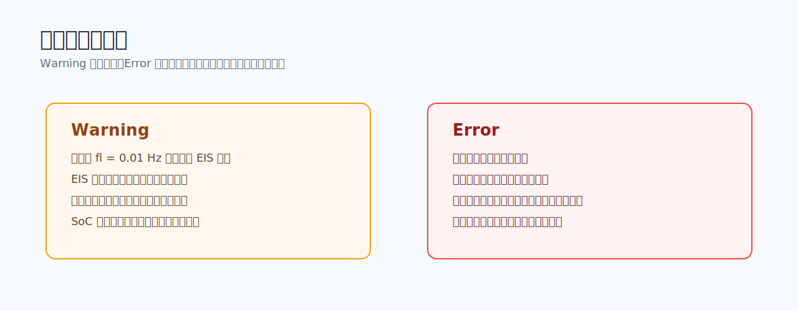

# OPEIS Master

**OPEIS Master** 是一个面向辰华 CHI 电化学工作站的本地桌面工具，用图形界面生成原位阻抗（in-situ EIS）实验脚本。生成结果是可直接粘贴到 **CHI Macro Command** 的纯命令文本，不把计算过程或公式写入最终脚本。



## 适合谁用

手写 CHI Macro Command 时，原位 EIS 流程往往需要在充放电、静置、阻抗扫描、文件命名和保存路径之间反复切换。这个工具把实验参数集中到一个桌面界面里，实时展开工步、预估风险，并在确认无错误后输出可复制脚本。

## 下载安装

Windows 用户可以直接下载发布包：

- [CHI-OPEIS-v0.2.0-windows-x64.zip](https://github.com/Jakiewbe/CHI-OPEIS/releases/tag/v0.2.0)
- 包内主程序：`CHI-OPEIS.exe`
- SHA256：`DBADBFE9D16AC4552F96FC886BFA47245A80106B0E3EF26F4907B6BC5CB660E8`

解压后请保留整个目录结构运行，不要只单独拷贝 `CHI-OPEIS.exe`，因为 PyInstaller 运行时依赖位于同级 `_internal/` 目录。

## 核心功能

| 模块 | 能力 |
| --- | --- |
| 序列模式 | 编辑时间取点、电压取点、静置工步和循环块，从上到下生成完整实验流程 |
| 脉冲模式 | 配置弛豫、脉冲、前后 EIS，以及可选尾段电压放电 |
| 电流换算 | 支持按材料参数或已知倍率电流确定 1C 基准，倍率输入自动转换为安培 |
| EIS 插入 | 每个工步可单独控制是否在取点后插入 IMPFT / IMPSF |
| 风险校验 | 在生成前突出展示 Warning / Error，Error 会阻止复制脚本 |
| 采样看板 | 预估 EIS 中断、SoC 风险和可能丢失的点位 |
| 预设文件 | 保存、打开和最近列表管理 `.chi-preset` 工作流 |



## 界面导览

左侧是参数输入区，按工作区、项目、电池与电流、工步、脉冲和阻抗参数分组。右侧是生成前必须关注的区域：总览、警告与错误、采样看板和脚本预览。

典型工作流：

1. 选择 `序列` 或 `脉冲` 模式。
2. 填写方案名、文件前缀和导出目录。
3. 设置电池质量、理论容量或已知倍率电流。
4. 添加时间取点、电压取点、静置工步或循环块。
5. 配置阻抗参数，包括 `fh`、`fl`、`amp`、`qt` 和 FT/SF 模式。
6. 查看 Warning / Error，确认采样看板和脚本预览。
7. 复制极简脚本到 CHI Macro Command。

## 校验与风险提示

OPEIS Master 会把生成脚本前的风险显著展示出来，避免高风险参数被直接带入实验。



常见 Warning 包括：

- 低频端 `fl = 0.01 Hz` 导致单次 EIS 时间过长。
- EIS 插入过密，恒流轨迹被频繁打断。
- 中断补偿累计时间过大，后续工步被明显拉长。
- SoC 预测显示实验完成前可能耗尽并丢失点位。

Error 会禁用复制按钮，必须修正后才能生成脚本。

## 输出脚本约定

最终输出面向 CHI Macro Command，遵循这些约定：

- 只输出 CHI 可执行命令，不输出公式或推导过程。
- 默认包含必要的 `fileoverride`、`folder`、`cellon`、`celloff`、`end` 等命令结构。
- 阻抗段、恒流段、弛豫段、脉冲段和尾段会使用清晰的保存名后缀。
- “极简脚本”区域就是复制到 CHI 的推荐文本。

## 源码运行

```powershell
py -3.11 -m venv .venv
.\.venv\Scripts\python -m pip install -e .[dev,build]
.\.venv\Scripts\python -m chi_generator.main
```

也可以使用兼容入口：

```powershell
.\.venv\Scripts\python -m opeis_master.main
```

## 测试与打包

运行测试：

```powershell
$env:QT_QPA_PLATFORM="offscreen"
.\.venv\Scripts\python -m pytest -q
```

打包 Windows EXE：

```powershell
.\build.bat
```

或直接调用 PyInstaller：

```powershell
.\.venv\Scripts\pyinstaller --noconfirm CHI-OPEIS.spec
```

打包产物位于 `dist/CHI-OPEIS/`。发布时应压缩整个目录，而不是只发布单个 EXE。

## 项目结构

```text
src/chi_generator/
├── domain/          领域模型、计算、校验、脚本渲染
├── services/        脚本生成与预设服务
├── ui/              PySide6 / Fluent Widgets 界面层
├── app.py           应用装配入口
└── main.py          主入口
src/opeis_master/    兼容层与旧导入路径
tests/               领域、渲染、GUI 合同测试
docs/                使用、架构、配置、测试和打包文档
```

## 设计原则

- UI 逻辑与领域计算严格分离。
- 所有参数校验在生成前完成。
- Warning 必须可见，Error 必须阻止脚本复制。
- 生成脚本保持纯命令，保证能直接粘贴到 CHI Macro Command。

## 许可证

本项目基于 MIT License 开源，详见 [LICENSE](LICENSE)。
